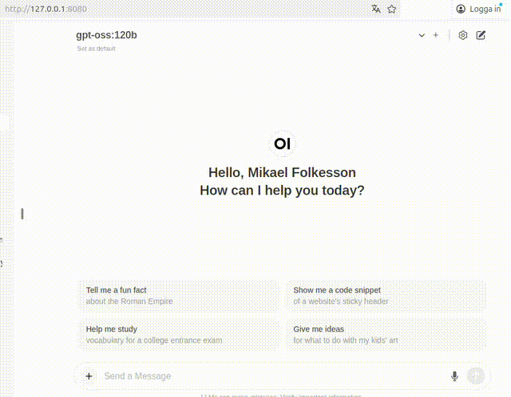
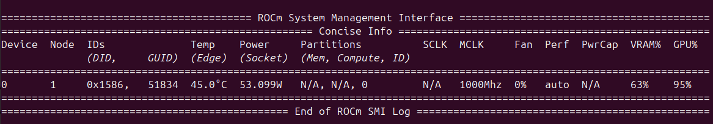

# ROCm support for Strix Halo

ROCm is now (nov 2025) officially supported by AMD on the Strix Halo architechture, see https://rocm.docs.amd.com/projects/radeon-ryzen/en/latest/docs/compatibility/compatibilityryz/native_linux/native_linux_compatibility.html

**Why is this a good thing?** It breaks the NVIDIA monopoly and makes it possible for a consumer computer under 2k EUR/USD to have 100+ GB VRAM and infer 120b models at speed! Compare 100+ GB VRAM to 32GB on a 5090, where only the 5090 sets you back roughly twice the amount needed to buy two whole GMKTec Evo-X2 or Bosgame M5 computers, or a 6000 Pro for 10k EUR where you still only get 96GB VRAM. Ok, to be fair, there's the DGX Sparc, but that is not a full blown computer and it still costs 2.5x.

*Enough to make any nerd drewl:* Here's a video showing inference in real time (no cutting) with the 120b model using Ollama in open-webui, where the GPU is consuming less power than a classic light bulb:



The steps for installing ROCm 7.1 are fairly straight-forward compared to how it had to be done for earlier versions of ROCm. The results here are based on running on a GMKtec EVO-X2 with 128GB RAM and 8TB SSD. 

Required components:

* Ubuntu 24.04 LTS
* Kernel 6.14 OEM
* ROCm v.7.1.1

This guide assumes you have the correct version of Ubuntu installed.

*Further down are also steps for installing PyTorch, Docling and Ollama with GPU acceleration.*

## Install the kernel

You need an up-to-date kernel that is known to work with ROCm. At the time of writing this is the one officially supported by AMD:

```bash
sudo apt update && sudo apt-get install linux-oem-24.04c
```
Then update grub.
```bash 
sudo update-grub
```

Reboot into the new kernel.

Make sure you are on the new kernel:

```bash 
uname -r
```
This should show something like "6.14.0-1016-oem".

### Making 6.14 default

Skip this step if you are on the correct kernel after a reboot. But if you for some reason are not, here's how to make it the default kernel.

First, check the exact name of the kernel using:

```bash
sudo grep menuentry /boot/grub/grub.cfg | grep -n 'Ubuntu'
```

Copy the exact name/description of the 6.14 OEM entry you want to make default.

Set the preferred entry as default:

```bash
sudo nano /etc/default/grub
```
Update the line with GRUB_DEFAULT to `GRUB_DEFAULT="Advanced options for Ubuntu>Ubuntu, with Linux 6.14.0-1016-oem"`, replacing "Ubuntu, with Linux 6.14.0-1015-oem" with your exact version. Then update grub.

```bash
sudo update-grub
```

After reboot, confirm that the correct kernel is in use:

```bash
uname -r
```

## Install ROCm

Now that you have the correct kernel, begin by doing a full update:

```bash
sudo apt update && sudo apt upgrade -y
```

Get and install the AMD GPU installer script:

```bash
wget https://repo.radeon.com/amdgpu-install/7.1.1/ubuntu/noble/amdgpu-install_7.1.1.70101-1_all.deb
sudo apt install ./amdgpu-install_7.1.1.70101-1_all.deb
```

Warnings like the one below can be safely ignored:

```N: Download is performed unsandboxed as root as file ‘/home/hakedev/amdgpu-install_7.1.1.70100-1_all.deb’ couldn’t be accessed by user ‘_apt’. - pkgAcquire::Run (13: Permission denied)```

Run the installer:

```bash 
amdgpu-install --usecase=rocm,opencl,hip,graphics,dkms
```
Make sure *not* to specify --no-dkms, as you will want those modules installed. Then add yourself to the video and render user groups:

```bash 
sudo usermod -aG video,render $USER
```

Reboot.

Run this to see if it finds the AMD GPU module:

```bash
lsmod | grep amdgpu
```

### If it did not find the GPU
If not, add it manually:

```bash 
sudo modprobe amdgpu
```

If it didn't find it before, it should now.

You can make this permanent by telling it to always load this module:

```bash
echo amdgpu | sudo tee /etc/modules-load.d/amdgpu.conf
```

But if it still doesn't find it, it could be that it is still blacklisted. Find out:

```bash
grep -R "blacklist amdgpu" /etc/modprobe.d
```

If something is found, you need to comment it out or remove it.

Edit the file listed in the output of the above command, e.g.:

```bash
sudo nano /etc/modprobe.d/blacklist-amdgpu.conf
```
Comment the line out using # or delete the line.

If you did the above step, you also need to rebuild initramfs specifying your kernel:

```bash
sudo update-initramfs -u -k 6.14.0-1015-oem
```

Reboot to make sure it sticks. 

### If it does find the GPU
Also make sure rocminfo finds it:

```bash
/opt/rocm/bin/rocminfo | grep -A3 Name
```

Congratulations, you now have ROCm support on your Strix Halo!

You can now use `rocm-smi` to check the status of your GPU (workload, temperature, VRAM usage). Use watch for permanent reading. In a terminal you can have this open (if you like):

```bash 
watch rocm-smi
```

# Official PyTorch support (Docling example)
Here's how to install Pytorch once ROCm is installed.

https://rocm.docs.amd.com/projects/radeon-ryzen/en/latest/docs/install/installryz/native_linux/install-pytorch.html

We will use `uv` to install it in virtual environments. Make sure to install pytorch before installing the requirements for the project, in order for the correct pytorch to be pulled. Installing the wrong pytorch first, then removing it, and only then installing the correct pytorch has a high probability of failure.

Make sure you have `astral-uv` installed:

```bash
sudo snap install astral-uv
```

In this scenario, we will install it for use with Docling, so we create a docling folder at a suitable location, e.g:

```bash
mkdir ~/docling
cd ~/docling
```

Pytorch is officially supported only for Python 3.12, so we create the venv with that version:

```bash
uv venv --python 3.12
source .venv/bin/activate
```

Install the latest pip and wheel:

```bash
uv pip install --upgrade pip wheel
```

Get the correct wheels and install them (these are for the ROCm 7.1 release):

```bash
wget https://repo.radeon.com/rocm/manylinux/rocm-rel-7.1.1/torch-2.9.1%2Brocm7.1.1.lw.git351ff442-cp312-cp312-linux_x86_64.whl
wget https://repo.radeon.com/rocm/manylinux/rocm-rel-7.1.1/torchvision-0.24.0%2Brocm7.1.1.gitb919bd0c-cp312-cp312-linux_x86_64.whl
wget https://repo.radeon.com/rocm/manylinux/rocm-rel-7.1.1/triton-3.5.1%2Brocm7.1.1.gita272dfa8-cp312-cp312-linux_x86_64.whl
wget https://repo.radeon.com/rocm/manylinux/rocm-rel-7.1.1/torchaudio-2.9.0%2Brocm7.1.1.gite3c6ee2b-cp312-cp312-linux_x86_64.whl
uv pip uninstall torch torchvision triton torchaudio
uv pip install torch-2.9.1+rocm7.1.1.lw.git351ff442-cp312-cp312-linux_x86_64.whl torchvision-0.24.0+rocm7.1.1.gitb919bd0c-cp312-cp312-linux_x86_64.whl torchaudio-2.9.0+rocm7.1.1.gite3c6ee2b-cp312-cp312-linux_x86_64.whl triton-3.5.1+rocm7.1.1.gita272dfa8-cp312-cp312-linux_x86_64.whl
```
Install docling 

```bash
uv pip install docling
```
Then make sure torch finds your GPU:

```bash
python3 -c 'import torch; print(torch.cuda.is_available())'
```
If true, you're all set.

# Increasing VRAM
Use either of the two paths below to increase the available VRAM, the default is 64GB (way too little, right?). Using the BIOS the maximum you can set is 96GB. Using amd-ttm you can set it freely (you can even set something like 112GB VRAM, leaving some 16GB RAM).

## Path 1: Set freely (recommended)

We can use the same Docling venv to install AMD debug tools:

```bash
uv pip install amd-debug-tools
```

Check your current settings:

```bash
amd-ttm
```

The default is 64 GB. If you want to maximize the amount of VRAM, do consider that that memory will not be available as RAM. You could theoretically set it to 128GB, but then you would have 0 RAM and the system would not work. Hence you will need a trade-off. I would suggest something like 108 GB, as that leaves 20GB RAM for the system. You can always tweak and tune depending on use-case. If you do not use all RAM but need more VRAM you could try out 116GB for instance. 

Set the amount of VRAM in GB:

```bash
amd-ttm --set 108
```

Reboot.

```bash
sudo reboot now
```

Run amd-ttm to check how much VRAM you currently have allocated:

```bash
amd-ttm
```

Not bad huh?

## Path 2: Set using BIOS

Use this guide:
https://www.gmktec.com/pages/evo-x2-bios-vram-size-adjustment-guide?srsltid=AfmBOor1wkTR5ylkKO2rbWj3Crbo6rQ7ACLjtdPFWTvHIBxllFScA8qn

If going for this path, and you at some point want to use the first path instead, you need to set the iGPU Configuration back to Auto first.

# Ollama

Use LLMs locally with GPU acceleration on Ollama. As the support for AMD GPU's is under development and some installs might go wonky somewhere in the process, it is not certain that Ollama will detect the GPU initially.

Try to install it and see if it runs `gpt-oss:120b` fast (~35 tokens/s) or sluggishly (~4 tokens/s).

Install Ollama using the official script:
```bash
curl -fsSL https://ollama.com/install.sh | sh
```

Run ollama for instance with the `gpt-oss:120b` model:

```bash
ollama run gpt-oss:120b
```

Once it has pulled it you can chat away with it. If you're not getting frustrated with the speed it's running on your GPU and everything is fine. If not, we need to try to fix it.

## If it runs on CPU

In this case it could be worthwhile to try to build both llama.cpp and ollama locally as there is still no native default support (at the time of writing).

```bash
cd ~
git clone https://github.com/ollama/ollama.git
cd ollama
```

Make sure ROCm is on PATH:

```bash
export PATH=/opt/rocm/bin:$PATH
```

Install Go:

```bash
sudo apt update
sudo apt install golang-go
```

Install Cmake:

```bash
sudo apt install cmake
```

Fetch the vendored llama.cpp and cd into the dir:
```bash
make -f Makefile.sync clean apply-patches sync
```

Create a build folder:

```bash
cd ~/ollama/llama/vendor
mkdir build
cd build
```

Configure for ROCm:

```bash
cmake .. -DGGML_HIPBLAS=ON
```

Build:
```bash
cmake --build . --config Release -j$(nproc)
```

When finished, test:

```bash
./bin/llama --help
```

You should see "BLAS = HIPBLAS" or "using HIP backend"

Now also build Ollama:

```bash
cd ~/ollama
go build .
```

Then point ollama to the libraries you compiled for your computer (replace the OLLAMA_LIBRARY_PATH with your path):

```bash
sudo systemctl edit ollama
```

Under [Service] add:

```bash
Environment="OLLAMA_LLM_LIBRARY=hip"
Environment="OLLAMA_LIBRARY_PATH=/home/yourusername/ollama/llama/vendor/lib/ollama"
Environment="HIP_VISIBLE_DEVICES=0"
```

Restart the service:

```bash
sudo systemctl daemon-reload
sudo systemctl restart ollama
journalctl -u ollama -n 50 -f
```
Hopefully now you should see that it recognizes your GPU.

Expect something like input tokens at 400-500 tokens per second, and output tokens at around 35 tokens per second on `gpt-oss:120b`.

With a moderate 96 GB VRAM setting `gpt-oss:120b` still only occupies 63% of the VRAM!



As if that would not be enough, there's a possibility to increase the speed even further:

# Bonus: Linux now has NPU support

If the prerequisites were filled for installing ROCm according to the above, you should also be able to install the Linux NPU drivers, as the requirements are less strict:

Ubuntu 24.04 LTS
Kernel >= 6.10
Python 3.10.x
RAM 32GB (64GB recommended)

For the Windows version, the following gains compared to running on GPU are specified:

BF16 Compiler improvements (for CNN, Transformer), average ~80% performance boost, 1.3× faster on CNN than iGPU, 2.6× faster for transformers than iGPU.

**Section to be updated as soon as I get access granted to the Ryzen AI Software Early Access Lounge:**

https://ryzenai.docs.amd.com/en/latest/linux.html#install-ryzen-ai-software

